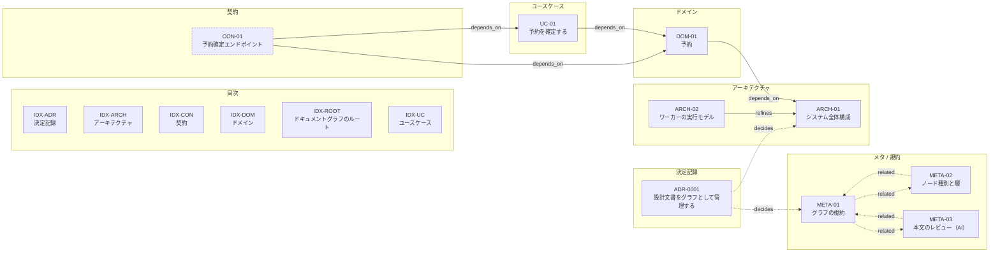

# graph-doc-template

**設計文書をグラフとして管理し、その整合性を CI で検証する**プロジェクトテンプレート。

1 文書 = 1 ノード、フロントマターの型つきリンク = エッジ。リンク切れ・孤立ノード・
循環依存・**層の逆流**を機械検証する。外部依存なし（Python 3.10+ の標準ライブラリのみ）。
**検証はオフラインで完結する。** 本文の質を AI に見てもらう `review` だけが通信するが、
これは任意のコマンドで、CI では回さない（[ai-review.md](docs/00-meta/ai-review.md)）。

## なぜ

設計文書は増えると必ず次の 3 つが起きる。

1. どこに何が書いてあるか分からなくなる
2. 上流（ドメイン）を変えたとき、下流（ユースケース・契約）の追従漏れに気づけない
3. 人も AI も、文書間の前提関係を毎回読み直して推測する

目次を手で整備しても 2 と 3 は解決しない。**前提関係そのものを機械可読にして検証する**のが
このテンプレートの主張。詳しくは [ADR-0001](docs/50-adr/adr-0001-graph-driven-docs.md)。

## 向くもの・向かないもの

**設計文書（何を作るか）のための道具**。実プロジェクトで試した結果、次が分かっている。

| 向く | 向かない |
| --- | --- |
| 概念と不変条件を持つドメインがある | **手順の順序が主役**（配置手順、移行計画） |
| 前提と影響範囲を追いたい | 時間の経過にともなう状態を扱いたい |
| 境界の契約を固めたい | ドメインが存在しない（運用記録、設定集） |

順序のある手順は書けないわけではないが、**グラフは順序を表さない**ので本文に書く。
その場合は手順書用の雛形を使う。

```bash
python -m tools.graph new --type usecase --template usecase-runbook --id UC-02 --title "..."
```

なお **`check` が通ることは「題材に合っている」ことを意味しない。** 見ているのは
リンクの整合性と依存の向きだけで、各層に中身があるかは見ていない
（[graph-rules.md](docs/00-meta/graph-rules.md) の「このグラフが扱えるもの・扱えないもの」）。

## すぐ試す

```bash
python -m tools.graph check
```

```bash
python -m tools.graph stats
```

グラフを図にする（Mermaid）:

```bash
python -m tools.graph render --format mermaid --out docs/graph.mmd
```

## 構成

```
docs/
  index.md              グラフのルート。全ノードはここから辿れること
  00-meta/              規約とテンプレート（グラフの語彙そのもの）
    graph-rules.md      ルール ID G001〜G013 と直し方
    node-types.md       ノード種別・接頭辞・置き場所・層
    templates/          new コマンドが使う雛形（グラフには含めない）
  10-architecture/      層 10: 構成要素と責務、境界
  20-domain/            層 20: 概念・不変条件・用語
  30-usecases/          層 30: 誰が何をして何が起きるか
  40-contracts/         層 40: 境界をまたぐ約束事
  50-adr/               横断: 決定・理由・却下案
tools/graph/            検証・可視化・生成ツール（依存なし）
```

依存は必ず**上の層（数字の小さい側）へ**向ける。逆向きは `G007` で落ちる。

```
40-contracts ──▶ 30-usecases ──▶ 20-domain ──▶ 10-architecture
```

## グラフ

同梱のサンプルノードで作ったグラフ。実線が `depends_on` と `refines`、
破線が `related` と `decides`、点線の枠が `draft` のノード。

<!-- graph:diagram:start -->

<!-- この図は render --into が生成する。手で編集しない -->



<!-- graph:diagram:end -->

図は `render --into` が生成する。CI で最新かどうかを検証している。

```bash
python -m tools.graph render --format mermaid --into README.md
```

### 近傍だけを描く

ノードが増えると全体図は読めなくなる。`--focus` で 1 ノードの周りだけを切り出す。

```bash
python -m tools.graph render --format mermaid --focus DOM-01
```

**エッジの向きは無視して両方向に辿る。** 前提（何に依存しているか）と
影響範囲（誰から依存されているか）は、どちらも同時に見たいものだから。
`--depth N` で範囲を広げられる（既定は 1）。焦点のノードは枠が太くなる。

`--focus` は `--format json` でも効くので、**変更の影響範囲を機械的に取り出す**のにも使える。

## コマンド

| コマンド | 用途 |
| --- | --- |
| `python -m tools.graph check` | 検証。エラーがあれば終了コード 1 |
| `python -m tools.graph check --strict` | 警告も失敗として扱う |
| `python -m tools.graph check --format json` | CI やエディタ連携向け |
| `python -m tools.graph sync` | 各文書末尾の「関連ドキュメント」を再生成 |
| `python -m tools.graph sync --check` | 再生成が必要なら終了コード 1（CI 用） |
| `python -m tools.graph render --format mermaid\|json\|dot` | 図・データの書き出し |
| `python -m tools.graph render --focus <ID>` | そのノードの近傍だけを描く（`--depth N`） |
| `python -m tools.graph render --into README.md` | README の図を再生成 |
| `python -m tools.graph render --into README.md --check` | 図が古ければ終了コード 1（CI 用） |
| `python -m tools.graph new --type usecase --id UC-02 --title "..."` | 雛形からノードを起こす |
| `python -m tools.graph new --from <file>` | 1 行 1 ノードのファイルからまとめて起こす |
| `python -m tools.graph reset-samples` | 同梱のサンプルノードを一括で取り除く |
| `python -m tools.graph upgrade` | テンプレートとの差を調べる（読み取りのみ） |
| `python -m tools.graph --version` | テンプレートの版 |
| `python -m tools.graph stats` | ノード数・エッジ数の集計 |
| `python -m tools.graph review` | **本文の質を AI に見てもらう（任意・通信あり）** |
| `python -m unittest discover -s tests -t .` | ツール自体のテスト |

`make check` `make sync` `make graph` も同じことをする（Makefile 参照）。

## 新しいノードを作る

```bash
python -m tools.graph new --type usecase --id UC-02 --title "予約をキャンセルする" --slug cancel-booking
```

これは 3 つのことを同時にやる。

1. `docs/30-usecases/uc-02-cancel-booking.md` を雛形から作る
2. フロントマターの `id` / `type` / `title` / `status` / 日付を埋める
3. `docs/30-usecases/index.md` の一覧に登録する（＝孤立ノードにしない）

あとは本文と `depends_on` を書いて `check` を通す。

同じ type に複数の書式が要るときは `--template` で雛形を選ぶ。
`contract` には汎用（既定）と HTTP 用の 2 つがある。

```bash
python -m tools.graph new --type contract --template contract-http --id CON-02 --title "..."

# チャットの操作（コマンド・ボタン）を書くなら
python -m tools.graph new --type contract --template contract-interaction --id CON-03 --title "..."
```

立ち上げ時などで数が多いときは、1 行 1 ノードのファイルからまとめて作る。

```bash
python -m tools.graph new --from docs/00-meta/new-nodes.txt
```

```
# type | id | title | slug | status | template
usecase | UC-02  | 予約をキャンセルする | cancel-booking
contract | CON-02 | キャンセル API | cancel-api | draft | contract-http
```

## 検証されること

| コード | 内容 |
| --- | --- |
| `G001` | フロントマターが読めない / 必須キー不足 |
| `G002` | `id` の重複 |
| `G003` | `id` 接頭辞・`type` 語彙・置き場所の不一致 |
| `G004` | リンク切れ（フロントマター・本文の `[[ID]]`・相対リンク） |
| `G005` | ルート目次から到達できない孤立ノード |
| `G006` | 依存の循環 |
| `G007` | 層の逆流 |
| `G008` | `refines` の種別不一致 |
| `G009` | `status` 語彙違反 / stable が draft に依存（警告） |
| `G010` | `related` が片側だけ（警告） |
| `G011` | `draft` / `review` のまま長期間放置（警告。git 履歴を使う） |
| `G012` | `depends_on` で参照されすぎ（警告。分割の合図） |
| `G013` | 依存先が「使ってはいけない言い換え」に挙げた語の使用（警告） |
| `G014` | 種別ごとに決めた必須の節が無い（警告） |

`G001`〜`G008` は構造の誤りで、直さなければ壊れている。`G009`〜`G014` は
**健全性の警告**で、承知のうえで放置してもよい（`--strict` で失敗扱いにできる）。
しきい値と必須の節は `tools/graph/schema.py` にある。

**CI では main への push だけ `--strict` を使う。** 開発中のブランチと PR では
警告を出すだけにして、書いている途中で止めない。

**`G014` は雛形の全節を求めない。** 「これが無いと文書として成立しない」節だけを
見る。全節を必須にすると、意図的に省いた節まで警告になる
（[graph-rules.md](docs/00-meta/graph-rules.md) の `G014` に測定結果がある）。

コードブロック・コードスパン・HTML コメントの中は検査しない。規約文書や雛形に
記法の例を書いても落ちない。逆に、コメントアウトした参照はグラフに現れない。

**本文の `[[ID]]` はリンク切れしか見ない。** 層（`G007`）と循環（`G006`）の検査を受けるのは
フロントマターの型つきエッジだけ。前提は本文ではなく `depends_on` に書く
（詳細は [graph-rules.md](docs/00-meta/graph-rules.md) の「本文リンクは層と循環の検査を受けない」）。

## 自分のプロジェクトに合わせる

1. **サンプルを消す** — 同梱のサンプルノードを取り除く。

   ```bash
   python -m tools.graph reset-samples --yes
   ```

   `tags` に `sample` を持つノード（ARCH-01 / ARCH-02 / DOM-01 / UC-01 / CON-01）を削除し、
   各 `index.md` の一覧からも外す。**他のノードからの参照は自動で消さない**ので、
   残った参照は `check` が `G004`（リンク切れ）として指す。それを見て直す

2. **ADR-0001 を残すか決める** — この進め方自体を採用するなら残す。
   残す場合、サンプル削除で切れた `decides` の参照を実プロジェクトのノードに張り替える

3. **表紙を書き換える** — この 3 つはテンプレートの説明のままなので、
   プロジェクトの説明に差し替える

   | ファイル | 何を書くか |
   | --- | --- |
   | `README.md` | プロジェクトの目的、読む順番、未確定なものの一覧 |
   | `CLAUDE.md` | エージェント向けの前提。グラフ規約の部分はそのまま使える |
   | `docs/index.md` | グラフのルート。層の表は流用でき、冒頭にプロジェクトの説明を足す |

4. **語彙を決める** — `tools/graph/schema.py` の `NODE_TYPES` と `EDGE_KINDS` を編集。
   層を増やす／減らす、ノード種別を足すのはここだけで済む。
   **まず 1〜3 で書き始めてみて、層が合わないと分かってから触るのでよい**

5. **表を合わせる** — 4 を変えたら `docs/00-meta/node-types.md` の表を一致させる

6. **雛形を直す** — `docs/00-meta/templates/*.md` を自分たちの書式にする

## テンプレートの更新を取り込む

このテンプレートから起こしたプロジェクトに、あとからテンプレート側の改善を反映する。
**ファイルをコピーしない。** どれが共通かの判断を毎回やることになり、
削除も伝わらず、いずれ静かにドリフトする。

### 最初に一度だけ

"Use this template" で作ったリポジトリはテンプレートと**履歴を共有していない**。
そのままマージすると、共通の祖先がないせいで共有ファイルまで軒並み競合する。
先に共有ファイルをテンプレートと一致させ、競合面を消してから繋ぐ。

1. 共有ファイルをテンプレートの内容で上書きしてコミットする。
   対象は `tools/`、`docs/00-meta/graph-rules.md`、`docs/00-meta/node-types.md`、
   `docs/00-meta/templates/`、`CLAUDE.md`、`Makefile`、`.github/`、
   `.gitattributes`、`.gitignore`、`LICENSE`。
   **`README.md`・`docs/index.md`・各 `index.md`・ノード本体は対象外**（プロジェクト固有）

2. upstream を追加する。

   ```bash
   git remote add template https://github.com/setopic/graph-doc-template.git
   ```

3. `merge=ours` ドライバを有効にする。`.gitattributes` の指定はこれがないと効かない。

   ```bash
   git config merge.ours.driver true
   ```

4. 初回だけ `--allow-unrelated-histories` を付けてマージする。

   ```bash
   git fetch template && git merge template/main --allow-unrelated-histories
   ```

### 取り込む

**まず差を調べる。** 読み取りのみで、何も書き込まない。

```bash
python -m tools.graph upgrade
```

遅れていれば、その間の変更履歴と、変更されるファイルの一覧が出る。
**major が上がっていれば移行作業が要る** — マージしただけでは壊れるので、
表示された移行手順を先に読む。

手順はこう。

```bash
git fetch template && git merge template/main
```

```bash
python -m tools.graph reset-samples --yes
```

```bash
python -m tools.graph check && python -m tools.graph sync
```

知っておくこと。

- **サンプルノードは毎回追加される。** マージはテンプレート側にしかないファイルを
  素直に足すので、`reset-samples` で消すところまでが 1 セット。省くと、
  プロジェクト側の同じ id と衝突して `G002` が残る
- **`README.md` と `docs/index.md` は競合しない。** `.gitattributes` の `merge=ours` で
  プロジェクト側が優先される。テンプレート側の改善を取り込みたいときは、
  `git diff HEAD template/main -- README.md` で差分を見て手で反映する
- テンプレートがサンプルノードを変更した場合だけ modify/delete の競合が出る。
  `git rm <path>` で解決してよい
- **初回のマージだけ** `--allow-unrelated-histories` が要る。
  GitHub の "Use this template" は履歴を引き継がないため

## AI エージェントと使う

[CLAUDE.md](CLAUDE.md) にエージェント向けの作業手順を書いてある。要点は 2 つ。

- 文脈は**全文書ではなく、対象ノードとその近傍**を渡す。`render --format json` が近傍の取得に使える
- 生成した文書は必ず `check` に通す。通らないものはマージしない

## CI

`.github/workflows/graph-check.yml` が push / PR で次の 3 つを回す。
GitHub 以外を使うなら、この 3 コマンドを同等のジョブに移すだけでよい。

```bash
python -m tools.graph check
```

```bash
python -m tools.graph sync --check
```

```bash
python -m tools.graph render --format mermaid --into README.md --check
```

3 つ目があるので、**グラフを変えたまま README の図を更新し忘れると CI が落ちる**。

## ライセンス

[MIT](LICENSE)。複製して自分のプロジェクトの土台にすることを想定している。
