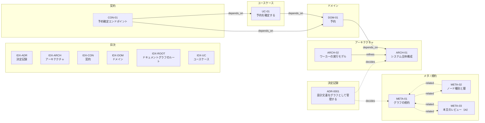

# graph-doc-template

設計文書をグラフとして管理し、その整合性をCIで検証するためのプロジェクトテンプレートである。

1つの文書を1つのノード、フロントマターの型つきリンクをエッジとして扱う。リンク切れ・孤立ノード・循環依存・層の逆流を、機械で検証する。外部依存は無く、Python 3.12+ の標準ライブラリだけで動く。**検証はオフラインで完結する。** 通信するのは、本文の質をAIに見てもらう`review`だけである。`review`は任意のコマンドで、CIでは回さない（[ai-review.md](docs/00-meta/ai-review.md)）。

## なぜ

設計文書が増えると、必ず次の3つが起きる。

1. どこに何が書いてあるか分からなくなる
2. 上流（ドメイン）を変えたとき、下流（ユースケース・契約）が追従していないことに気づけない
3. 人もAIも、文書どうしの前提関係を毎回読み直して推測する

目次を手で整えても、2と3は解決しない。前提関係そのものを機械が読める形にして検証する、というのがこのテンプレートの主張である。詳しくは[ADR-0001](docs/50-adr/adr-0001-graph-driven-docs.md)にある。

## 向くもの・向かないもの

このテンプレートは、設計文書（何を作るか）のための道具である。実際のプロジェクトで試した結果、次のことが分かっている。

| 向く | 向かない |
| --- | --- |
| 概念と不変条件を持つドメインがある | 手順の順序が主役（配置手順、移行計画） |
| 前提と影響範囲を追いたい | 時間の経過にともなう状態を扱いたい |
| 境界の契約を固めたい | ドメインが存在しない（運用記録、設定集） |

順序のある手順も書けないわけではないが、グラフは順序を表さないので、順序は本文に書く。その場合は、手順書用の雛形を使う。

```bash
python -m tools.graph new --type usecase --template usecase-runbook --id UC-02 --title "..."
```

なお、**`check`が通っても、題材に合っているとは限らない。** `check`が見ているのはリンクの整合性と依存の向きだけで、各層に中身があるかは見ていない（[graph-rules.md](docs/00-meta/graph-rules.md)の「このグラフが扱えるもの・扱えないもの」）。

## すぐ試す

```bash
python -m tools.graph check
```

```bash
python -m tools.graph stats
```

グラフを図（Mermaid）にするときは、次を使う。

```bash
python -m tools.graph render --format mermaid --out docs/graph.mmd
```

## 構成

```
docs/
  index.md              グラフのルート。全ノードはここから辿れること
  00-meta/              規約とテンプレート（グラフの語彙そのもの）
    graph-rules.md      ルール ID G001〜G023 と直し方
    node-types.md       ノード種別・接頭辞・置き場所・層
    templates/          new コマンドが使う雛形（グラフには含めない）
  10-architecture/      層 10: 構成要素と責務、境界
  20-domain/            層 20: 概念・不変条件・用語
  30-usecases/          層 30: 誰が何をして何が起きるか
  40-contracts/         層 40: 境界をまたぐ約束事
  50-adr/               横断: 決定・理由・却下案
tools/graph/            検証・可視化・生成ツール（依存なし）
```

依存は、必ず上の層（数字の小さい側）へ向ける。逆向きの依存は`G007`で落ちる。

```
40-contracts ──▶ 30-usecases ──▶ 20-domain ──▶ 10-architecture
```

## グラフ

同梱のサンプルノードで作ったグラフである。実線が`depends_on`と`refines`、破線が`related`と`decides`を表す。点線の枠は`draft`のノードである。

<!-- graph:diagram:start -->

<!-- この図は render --into が生成する。手で編集しない -->


```mermaid
graph LR
  subgraph index["目次"]
    IDX-ADR["IDX-ADR<br/>決定記録"]
    IDX-ARCH["IDX-ARCH<br/>アーキテクチャ"]
    IDX-CON["IDX-CON<br/>契約"]
    IDX-DOM["IDX-DOM<br/>ドメイン"]
    IDX-ROOT["IDX-ROOT<br/>ドキュメントグラフのルート"]
    IDX-UC["IDX-UC<br/>ユースケース"]
  end
  subgraph meta["メタ / 規約"]
    META-01["META-01<br/>グラフの規約"]
    META-02["META-02<br/>ノード種別と層"]
    META-03["META-03<br/>本文のレビュー（AI）"]
  end
  subgraph architecture["アーキテクチャ"]
    ARCH-01["ARCH-01<br/>システム全体構成"]
    ARCH-02["ARCH-02<br/>ワーカーの実行モデル"]
  end
  subgraph domain["ドメイン"]
    DOM-01["DOM-01<br/>予約"]
  end
  subgraph usecase["ユースケース"]
    UC-01["UC-01<br/>予約を確定する"]
  end
  subgraph contract["契約"]
    CON-01["CON-01<br/>予約確定エンドポイント"]
  end
  subgraph adr["決定記録"]
    ADR-0001["ADR-0001<br/>設計文書をグラフとして管理する"]
  end
  ADR-0001 -.->|decides| META-01
  ADR-0001 -.->|decides| ARCH-01
  ARCH-02 -->|refines| ARCH-01
  CON-01 -->|depends_on| UC-01
  CON-01 -->|depends_on| DOM-01
  DOM-01 -->|depends_on| ARCH-01
  META-01 -.->|related| META-02
  META-01 -.->|related| META-03
  META-02 -.->|related| META-01
  META-03 -.->|related| META-01
  UC-01 -->|depends_on| DOM-01
  classDef draft stroke-dasharray: 4\,3;
  classDef deprecated opacity:0.5;
  class CON-01 draft;
```

<!-- graph:diagram:end -->

図は`render --into`が生成する。図が最新かどうかは、CIが検証している。

```bash
python -m tools.graph render --format mermaid --into README.md
```

### 近傍だけを描く

ノードが増えると、全体図は読めなくなる。`--focus`を使うと、1つのノードの周りだけを切り出せる。

```bash
python -m tools.graph render --format mermaid --focus DOM-01
```

エッジの向きは無視して、両方向に辿る。前提（何に依存しているか）と影響範囲（誰から依存されているか）は、どちらも同時に見たいものだからである。`--depth N`で範囲を広げられる（既定は1）。焦点のノードは、枠が太くなる。

`--focus`は`--format json`でも使えるので、変更の影響範囲を機械的に取り出すのにも役立つ。

## コマンド

| コマンド | 用途 |
| --- | --- |
| `python -m tools.graph check` | 検証する。エラーがあれば終了コード1 |
| `python -m tools.graph check --strict` | 警告も失敗として扱う |
| `python -m tools.graph check --format json` | CIやエディタとの連携に使う |
| `python -m tools.graph check --since origin/main` | `G015`（追従漏れ）で見る変更の窓を広げる |
| `python -m tools.graph check --no-history` | gitを見ない（`G011`・`G015`・`G017`を飛ばす） |
| `python -m tools.graph sync` | 各文書の末尾の「関連ドキュメント」、目次の一覧、ドメインの目次の「用語の一覧」を作り直す |
| `python -m tools.graph sync --check` | 作り直しが必要なら終了コード1（CI用） |
| `python -m tools.graph linkify` | 本文の`[[ID]]`を相対リンクに直す |
| `python -m tools.graph linkify --check` | 直す必要があれば終了コード1（CI用） |
| `python -m tools.graph render --format mermaid\|json\|dot` | 図やデータを書き出す |
| `python -m tools.graph render --focus <ID>` | そのノードの近傍だけを描く（`--depth N`） |
| `python -m tools.graph render --aggregate` | 型ごとに1つの箱へまとめる（`G018`を避ける） |
| `python -m tools.graph render --into README.md` | READMEの図を作り直す |
| `python -m tools.graph render --into README.md --check` | 図が古ければ終了コード1（CI用） |
| `python -m tools.graph new --type usecase --id UC-02 --title "..."` | 雛形からノードを作る |
| `python -m tools.graph new --from <file>` | 1行に1ノードを書いたファイルから、まとめて作る |
| `python -m tools.graph reset-samples` | 同梱のサンプルノードをまとめて取り除く |
| `python -m tools.graph upgrade` | テンプレートとの差を調べる（読み取りのみ） |
| `python -m tools.graph --version` | テンプレートの版を表示する |
| `python -m tools.graph stats` | ノード数・エッジ数を集計する |
| `python -m tools.graph review` | 本文の質をAIに見てもらう（任意・通信あり） |
| `python -m unittest discover -s tests -t .` | ツール自体のテスト |

`make check`・`make sync`・`make linkify`・`make readme`も、同じことをする（Makefileを参照）。まとめて回すなら`make all`を使う（`check`・`sync`・`linkify`・`readme`）。

エージェント向けのスキルが`.claude/skills/`にある。`/grill`は要件を書き始める前に詰める。`/yomiyasu`は日本語の文章を読みやすく直す。日本語の書き方の決まりはCLAUDE.mdの「日本語の書き方」にある。

## 新しいノードを作る

```bash
python -m tools.graph new --type usecase --id UC-02 --title "予約をキャンセルする" --slug cancel-booking
```

このコマンドは、次の3つを同時に行う。

1. `docs/30-usecases/uc-02-cancel-booking.md`を雛形から作る
2. フロントマターの`id`・`type`・`title`・`status`・日付を埋める
3. `docs/30-usecases/index.md`の一覧に登録する（孤立ノードにしない）

あとは本文と`depends_on`を書いて、`check`を通す。

同じtypeに複数の書式が要るときは、`--template`で雛形を選ぶ。`contract`には、汎用（既定）、HTTP用、チャットの操作用の3つがある。

```bash
python -m tools.graph new --type contract --template contract-http --id CON-02 --title "..."

# チャットの操作（コマンド・ボタン）を書くなら
python -m tools.graph new --type contract --template contract-interaction --id CON-03 --title "..."
```

立ち上げのときなど、作るノードが多いときは、1行に1ノードを書いたファイルからまとめて作る。

```bash
python -m tools.graph new --from docs/00-meta/new-nodes.txt
```

```
# type | id | title | slug | status | template
usecase | UC-02  | 予約をキャンセルする | cancel-booking
contract | CON-02 | キャンセル API | cancel-api | draft | contract-http
```

## 検証されること

| コード | 内容 |
| --- | --- |
| `G001` | フロントマターが読めない / 必須キーが足りない |
| `G002` | `id`の重複 |
| `G003` | `id`の接頭辞・`type`の語彙・置き場所が合わない |
| `G004` | リンク切れ（フロントマター・本文の`[[ID]]`・相対リンク） |
| `G005` | ルートの目次から到達できない孤立ノード |
| `G006` | 依存の循環 |
| `G007` | 層の逆流 |
| `G008` | `refines`の種別が合わない |
| `G009` | `status`の語彙違反 / stableがdraftに依存している（警告） |
| `G010` | `related`が片側だけ（警告） |
| `G011` | `draft`・`review`のまま長期間放置されている（警告。gitの履歴を使う） |
| `G012` | `depends_on`で参照されすぎている（警告。分割を考えるきっかけ） |
| `G013` | 依存先の用語表が「旧称」に挙げた語を使っている（警告。1.19までの「使ってはいけない言い換え」も読む） |
| `G014` | 種別ごとに決めた必須の節が無い（警告） |
| `G015` | 依存先を変えたのに、依存元を見ていない（警告。gitの変更の窓を見る） |
| `G016` | `implemented_by`の指し先が存在しない |
| `G017` | 文書と実装の片方だけが変わった（警告。同じく変更の窓を見る） |
| `G018` | READMEの図が、GitHubの描画上限（エッジ500本）に達した / 近づいた |
| `G019` | Markdownの表が途中で切れている（段落や空行が挟まっている） |
| `G020` | 取り下げた決定を、断りなく現在の根拠として引いている（警告） |
| `G021` | 自動生成ブロックより後ろに本文が残っている |
| `G022` | 同じ用語が複数のドメインノードの用語表にあり、定義元へのリンクが無い（警告） |
| `G023` | 契約が「対応」に挙げたユースケースを`depends_on`に書いていない（警告） |

`G001`〜`G008`と`G016`は構造の誤りで、直さなければ文書として成り立たない。`G009`〜`G015`と`G017`・`G020`・`G022`・`G023`は健全性の警告で、承知のうえで放置してもよい（`--strict`を付ければ失敗として扱える）。`G018`は、上限に近づいていれば警告、達していればエラーになる。達した時点で、図は描画されていないからである。`G019`と`G021`はエラーである。切れた行はすでにただの文字列として表示されていて、自動ブロックの下に回った本文は読む人に届いていない。しきい値と必須の節は、`tools/graph/schema.py`にある。

`G018`・`G019`・`G021`は、見た目と、読む人に届くかどうかを見ている。グラフの整合性はすべて通るのに、読む人のところで崩れている、という種類の問題が実際に起きたためである。`G021`は`sync`では直らない。`sync`はブロックをその場で入れ替えるだけで、後ろに回った本文は動かさない。

`G015`と`G016`・`G017`は、使う場面が違う。`G015`は文書どうしの追従漏れを、`G016`・`G017`は文書と実装の対応を見る。`G016`・`G017`は、`implemented_by`を書いたときだけ働く。**どちらも「見たか」を確かめるもので、「直せ」という指示ではない。**

`G020`は`G009`と重ならない。`G009`は、`stable`なノードの`depends_on`だけを見る。`G020`は本文のリンクを見て、取り下げた決定を断りなく引いていないかを確かめる。同じ段落で置き換え先も指していれば、警告しない。

`G020`は、確定した記録を見ない（`schema.py`の`IMMUTABLE_RECORD_TYPES`。既定は`stable`なADR）。確定したADRは書き換えないもので、決定を変えるときは新しいADRを起こす。直せないものに警告を出しても、`--strict`を通らなくするだけである。確定前（`draft`・`review`）のADRは直せるので、対象に残る。実際に見るのは、現在の設計を述べる層だけになる。

**CIでは、mainへのpushとPRで`--strict`を使う。** PRで落ちなければ、マージした後のmainも落ちない。PRの`--strict`は`--since`を付けずに走らせるので、`G015`・`G017`では失敗しない（一覧だけを出す）。それ以外のブランチへのpushでは、警告を出すだけにして、書いている途中で止めない。

`G014`は、雛形の全節は求めない。見るのは、それが無いと文書として成立しない節だけである。全節を必須にすると、意図して省いた節まで警告になる（[graph-rules.md](docs/00-meta/graph-rules.md)の`G014`に、測った結果がある）。

コードブロック・コードスパン・HTMLコメントの中は検査しない。規約の文書や雛形に記法の例を書いても、落ちない。逆に、コメントアウトした参照はグラフに現れない。

本文のリンクは、リンク切れしか検査されない。層（`G007`）と循環（`G006`）の検査を受けるのは、フロントマターの型つきエッジだけである。前提は本文ではなく、`depends_on`に書く（詳しくは[graph-rules.md](docs/00-meta/graph-rules.md)の「本文リンクは層と循環の検査を受けない」）。

本文に残す形は相対リンクである。`[[ID]]`は書くときの略記で、そのままではGitHub上でただの文字として表示され、読み手はクリックできない。2つの形はどちらも同じ参照として扱われるので、`linkify`が相対リンクに整形する。

```bash
python -m tools.graph linkify
```

## 自分のプロジェクトに合わせる

1. サンプルを消す。同梱のサンプルノードを取り除く。

   ```bash
   python -m tools.graph reset-samples --yes
   ```

   `tags`に`sample`を持つノード（ARCH-01・ARCH-02・DOM-01・UC-01・CON-01）を削除し、各`index.md`の一覧からも外す。**ほかのノードからの参照は自動では消さない。** 残った参照は、`check`が`G004`（リンク切れ）として挙げるので、それを見て直す

2. ADR-0001を残すかを決める。この進め方自体を採用するなら残す。残す場合は、サンプルを削除して切れた`decides`の参照を、実際のプロジェクトのノードに張り替える

3. 表紙を書き換える。次の3つはテンプレートの説明のままなので、プロジェクトの説明に差し替える

   | ファイル | 何を書くか |
   | --- | --- |
   | `README.md` | プロジェクトの目的、読む順番、未確定なものの一覧 |
   | `CLAUDE.md` | エージェント向けの前提。グラフの規約の部分はそのまま使える |
   | `docs/index.md` | グラフのルート。層の表は流用でき、冒頭にプロジェクトの説明を足す |

4. 語彙を決める。`tools/graph/schema.py`の`NODE_TYPES`と`EDGE_KINDS`を編集する。層を増やしたり減らしたり、ノード種別を足したりするのは、ここだけで済む。まず1〜3の状態で書き始めてみて、層が合わないと分かってから触ればよい

5. 表を合わせる。4を変えたら、`docs/00-meta/node-types.md`の表を一致させる

6. 雛形を直す。`docs/00-meta/templates/*.md`を、自分たちの書式にする

## テンプレートの更新を取り込む

このテンプレートから作ったプロジェクトに、あとからテンプレート側の改善を反映する手順である。**ファイルをコピーしない。** コピーすると、どれが共通のファイルかを毎回判断することになり、削除も伝わらず、いずれ気づかないうちにテンプレートとずれていく。

### 最初に一度だけ

"Use this template"で作ったリポジトリは、テンプレートと履歴を共有していない。そのままマージすると、共通の祖先が無いので、共有ファイルまで軒並み競合する。先に共有ファイルをテンプレートと一致させ、競合するところを無くしてから繋ぐ。

1. 共有ファイルをテンプレートの内容で上書きして、コミットする。対象は`tools/`、`docs/00-meta/`、`.claude/skills/`、`CLAUDE.md`、`TEMPLATE_CHANGELOG.md`、`Makefile`、`.github/`、`.gitattributes`、`.gitignore`、`LICENSE`である。`README.md`・`docs/index.md`・各`index.md`・ノード本体は、プロジェクト固有なので対象外である

2. upstreamを追加する。

   ```bash
   git remote add template https://github.com/setopic/graph-doc-template.git
   ```

3. `merge=ours`ドライバを有効にする。これが無いと、`.gitattributes`の指定は効かない。

   ```bash
   make setup
   ```

   **この設定はクローンごとに要る。** 設定されていないと、gitは指定を何も言わずに無視し、通常のマージを行う。警告は出ないので、保護が外れていること自体が見えない。何度実行しても結果は同じなので、取り込みの前に毎回実行してよい。

4. 初回だけ、`--allow-unrelated-histories`を付けてマージする。

   ```bash
   git fetch template && git merge template/main --allow-unrelated-histories
   ```

### 取り込む

まず、テンプレートとの差を調べる。このコマンドは読み取りだけで、何も書き込まない。

```bash
python -m tools.graph upgrade
```

テンプレートより遅れていれば、その間の変更履歴と、変更されるファイルの一覧が出る。**majorが上がっていれば、移行作業が要る。** マージしただけでは動かなくなるので、表示された移行手順を先に読む。

取り込みの手順は次のとおりである。

```bash
make setup && git fetch template && git merge template/main
```

```bash
python -m tools.graph reset-samples --yes
```

```bash
python -m tools.graph check && python -m tools.graph sync
```

取り込むときに知っておくことは、次のとおりである。

| 知っておくこと | 説明 |
| --- | --- |
| サンプルノードは毎回追加される | マージは、テンプレート側にしかないファイルをそのまま足す。そのため、`reset-samples`で消すところまでが1セットである。省くと、プロジェクト側の同じidと衝突して`G002`が残る |
| `README.md`と`docs/index.md`は競合しない | `.gitattributes`の`merge=ours`で、プロジェクト側が優先される。テンプレート側の改善を取り込みたいときは、`git diff HEAD template/main -- README.md`で差分を見て、手で反映する |
| テンプレートがサンプルノードを変更したときだけ、modify/deleteの競合が出る | `git rm <path>`で解決してよい |
| 初回のマージだけ`--allow-unrelated-histories`が要る | GitHubの"Use this template"は、履歴を引き継がないため |

## AIエージェントと使う

[CLAUDE.md](CLAUDE.md)に、エージェント向けの作業手順を書いてある。要点は2つある。1つは、文脈として全文書ではなく、対象ノードとその近傍を渡すことである。近傍は`render --format json`で取得できる。もう1つは、生成した文書を必ず`check`に通すことである。通らないものはマージしない。

## CI

`.github/workflows/graph-check.yml`が、pushとPRで次の5つを確かめる。最後に`stats`で集計も出す。GitHub以外を使うなら、これらのコマンドを同等のジョブに移すだけでよい。

| 順 | コマンド | 確かめること |
| --- | --- | --- |
| 1 | `python -m unittest discover -s tests -t .` | ツール自体のテスト |
| 2 | `python -m tools.graph check` | グラフの検証。mainへのpushとPRでは`--strict`を付ける。PRでは`--since`付きで追従漏れの一覧も出す |
| 3 | `python -m tools.graph sync --check` | 関連ドキュメント・目次の一覧・用語の一覧が最新か |
| 4 | `python -m tools.graph linkify --check` | 本文の`[[ID]]`が相対リンクに直っているか |
| 5 | `make readme-check` | READMEの図が最新か |

5つ目は、`render --into README.md --check`を`make`経由で呼ぶ。`graph.mk`の`README_GRAPH_ARGS`（`--aggregate`など）を効かせるためである。5つ目があるので、グラフを変えたままREADMEの図を更新し忘れると、CIが落ちる。

## ライセンス

[MIT](LICENSE)。複製して、自分のプロジェクトを始めるのに使うことを想定している。
